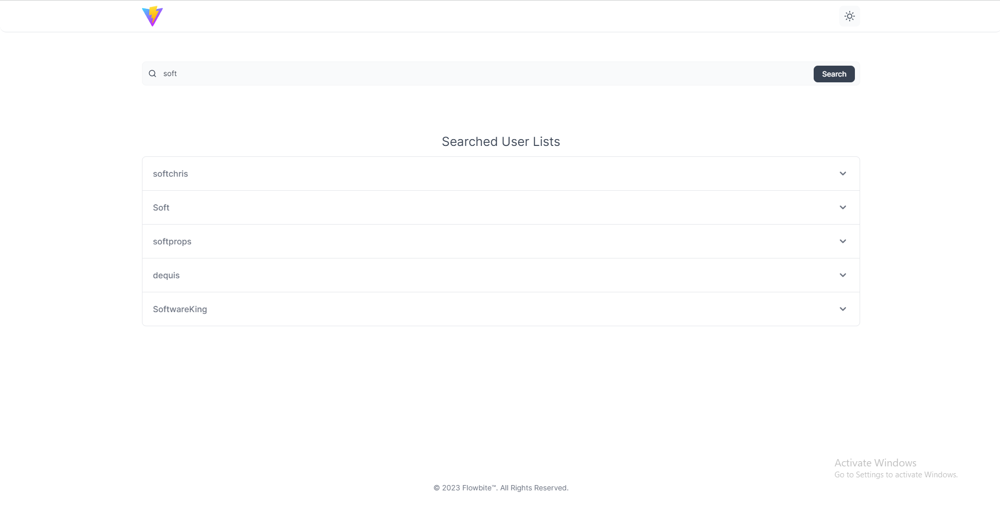
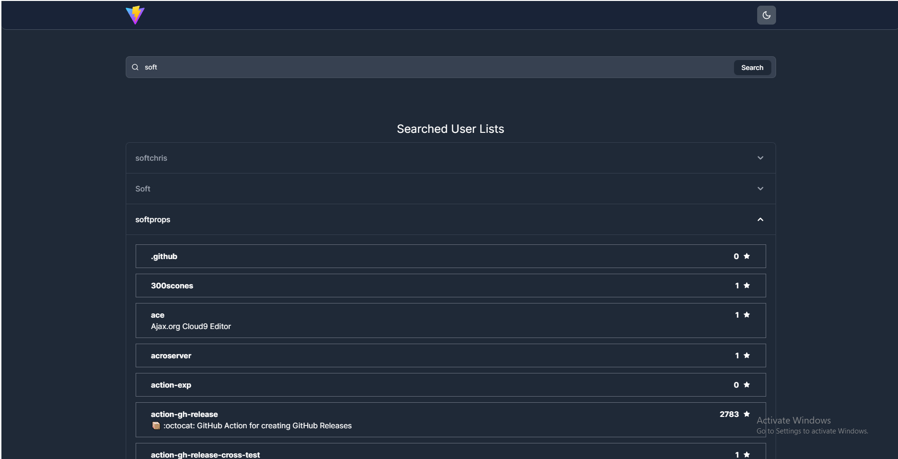

# react_recruitment_task

This is a React (TypeScript) project that fetches user and repository data from Github. It was developed as a technical assessment task for Atask. Please feel free to review my work and provide feedback.

## Screenshot(Light Mode)


## Screenshot(Dark Mode)


## Public url

https://reactrecruitment.netlify.app/

## Dependencies

* TypeScript
* Vite
* React
* Tailwind CSS

## Setup

```
yarn install
```

## start the app

```
yarn dev
```